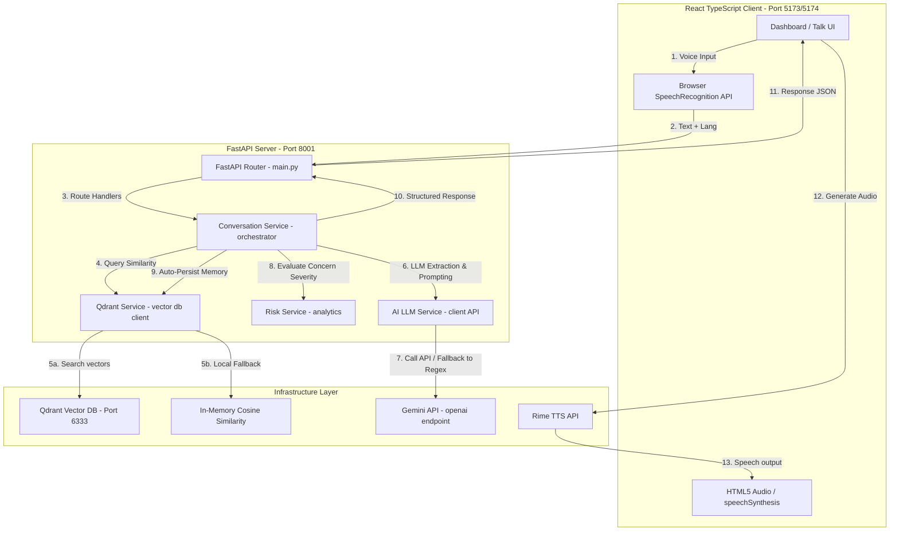

# Nuvia Project Architecture & Deep Analysis

Nuvia is a **voice-first, context-aware health support companion** designed to capture health concerns naturally through spoken language, parse those concerns structurally, retrieve historical patient context, evaluate clinical risk levels, and respond in a natural voice.

This document provides a comprehensive analysis of the project's features, under-the-hood data flows, architecture, and structural implementation.

---

## 1. Core Architecture Diagram

The system operates on a decoupled client-server architecture with fallback loops that allow it to function even if external APIs or Docker containers are offline.



---

## 2. Deep Dive: The Core Features & How They Work

### Feature A: Voice-First Interaction (STT & TTS)
* **Voice Input (STT)**: Built using the browser's native `SpeechRecognition` API (defined in [useSpeechRecognition.ts](file:///c:/Users/ASUS/OneDrive/Documents/MY%20Projects/New%20folder/nuvia/frontend/src/hooks/useSpeechRecognition.ts)). This allows for multi-language transcription (Hindi, English, Hinglish) without any cloud transcription costs or API key dependencies.
* **Voice Output (TTS)**: Orchestrated via [tts.py](file:///c:/Users/ASUS/OneDrive/Documents/MY%20Projects/New%20folder/nuvia/backend/app/routes/tts.py). It uses the **Rime TTS API** for premium, natural voice synthesis. If no `RIME_API_KEY` is present in the `.env` file, the application falls back seamlessly to the browser's local `speechSynthesis` API (`window.speechSynthesis`), ensuring the interface always speaks back.

### Feature B: Context-Aware Memory (Qdrant & Hash Vector Fallback)
Unlike generic chatbots that start every conversation from scratch, Nuvia checks past health concerns to establish context.
* **Qdrant Vector DB Integration**: When Qdrant is running, memories are converted to vectors and queried using vector similarity. Crucially, the system implements **payload isolation** ([qdrant_service.py](file:///c:/Users/ASUS/OneDrive/Documents/MY%20Projects/New%20folder/nuvia/backend/app/services/qdrant_service.py#L155-L160)): every query is filtered by `user_id` so that users can never retrieve other users' memories.
* **Deterministic Hash Vector Fallback**: If Docker is offline, Nuvia runs a custom in-memory cosine similarity engine. It embeds text by evaluating occurrence profiles across a structured vocabulary list (`HEALTH_VOCAB`) combined with MD5 hash padding to match the vector size (64 dimensions), ensuring search functionality remains intact.

### Feature C: Rule-Based & AI Hybrid Pipeline
Nuvia is engineered to be resilient. Every extraction and response generation stage operates on a hybrid model (LLM with local regex fallbacks):

| Stage | AI / LLM Behavior | Local Fallback Behavior | File Reference |
| :--- | :--- | :--- | :--- |
| **Symptom Extraction** | Uses Gemini to extract structured JSON containing symptoms, durations, and timing. | Scans text using regex patterns against a pre-defined symptom dictionary (Hinglish/Hindi/English mapping). | [ai_service.py](file:///c:/Users/ASUS/OneDrive/Documents/MY%20Projects/New%20folder/nuvia/backend/app/services/ai_service.py#L146) / [conversation_service.py](file:///c:/Users/ASUS/OneDrive/Documents/MY%20Projects/New%20folder/nuvia/backend/app/services/conversation_service.py#L329) |
| **Response Generation** | Asks a single contextual follow-up, assigns attention levels, and generates guidance using profile history. | Generates a language-specific safe checkup prompt and retrieves basic health advice based on symptoms. | [ai_service.py](file:///c:/Users/ASUS/OneDrive/Documents/MY%20Projects/New%20folder/nuvia/backend/app/services/ai_service.py#L162) / [conversation_service.py](file:///c:/Users/ASUS/OneDrive/Documents/MY%20Projects/New%20folder/nuvia/backend/app/services/conversation_service.py#L358) |

### Feature D: Risk Monitoring & Onboarding Profile
* **Onboarding Profile**: Located in [OnboardingPage.tsx](file:///c:/Users/ASUS/OneDrive/Documents/MY%20Projects/New%20folder/nuvia/frontend/src/pages/OnboardingPage.tsx). It gathers name, age, and pregnancy details.
* **Risk Engine**: Located in [risk_service.py](file:///c:/Users/ASUS/OneDrive/Documents/MY%20Projects/New%20folder/nuvia/backend/app/services/risk_service.py). It tracks symptoms from historical memories. If it detects symptoms that indicate potential complications (e.g., headache + swelling or dizziness in a pregnant user), it upgrades the risk level to `NEEDS ATTENTION` or `URGENT`.
* **SOS Dispatch**: Located in [RiskMonitorPage.tsx](file:///c:/Users/ASUS/OneDrive/Documents/MY%20Projects/New%20folder/nuvia/frontend/src/pages/RiskMonitorPage.tsx). When an urgent concern is flagged, users can trigger an SOS which simulated hospital dispatching, logs location details, and triggers notification alerts.

---

## 3. Step-by-Step Pipeline Flow (e.g., "Mujhe kal se sir dard hai...")

```
[User Input] "Mujhe kal se sir dard ho raha hai aur aaj thoda chakkar bhi aa raha hai."
      ↓
[1. Speech Recognition] Browser converts speech to text.
      ↓
[2. Qdrant Memory Fetch] Search past records for "sir dard" / "headache" / "chakkar" / "dizziness".
      ↳ Hits: mem_001 ("User mentioned a headache two days ago.")
      ↓
[3. Extraction Phase] LLM (or Fallback) extracts:
      ↳ Symptom 1: Headache (Duration: Since yesterday)
      ↳ Symptom 2: Dizziness (Duration: Today)
      ↓
[4. Decision / Prompt Engineering] Profile loaded: 26yo, Pregnant (Month 4).
      ↳ Prompt evaluates current concern + previous memory (headache 2 days ago) + pregnancy status.
      ↓
[5. Risk Analysis Engine]
      ↳ Flags "Headache + Dizziness" combination under pregnancy profile.
      ↳ Computes Support Level: NEEDS ATTENTION.
      ↓
[6. Synthesis Output]
      ↳ Guidance: Safe supportive tips in Hindi/Hinglish (Consult doctor if worsens).
      ↳ Question: "I remember you mentioned dizziness before. Has it been continuous?"
      ↳ Why: "Relevant previous context retrieved."
      ↓
[7. TTS Synthesis Engine] Audio is streamed back to user.
```

---

## 4. Why This Architecture Was Built This Way

1. **Zero-Lockout Design**: Healthcare companions must not fail due to API limit restrictions (such as the Gemini 429 limit seen during our tests) or networking drops. By hosting local embedded vocabulary calculations and rule engines, Nuvia runs fully offline in "Demo Mode" without any external connections.
2. **Context Retention**: Standard chatbots have "amnesia". By embedding a lightweight memory database (Qdrant), Nuvia acts like a real caregiver who remembers what you said last week.
3. **Clinical Safety Boundaries**: Because Nuvia is not a diagnostic tool, the system prompt and fallbacks strictly restrict the language from claiming diagnosis. It separates the "what was understood" from "careful supportive guidance" explicitly to avoid legal liability.
